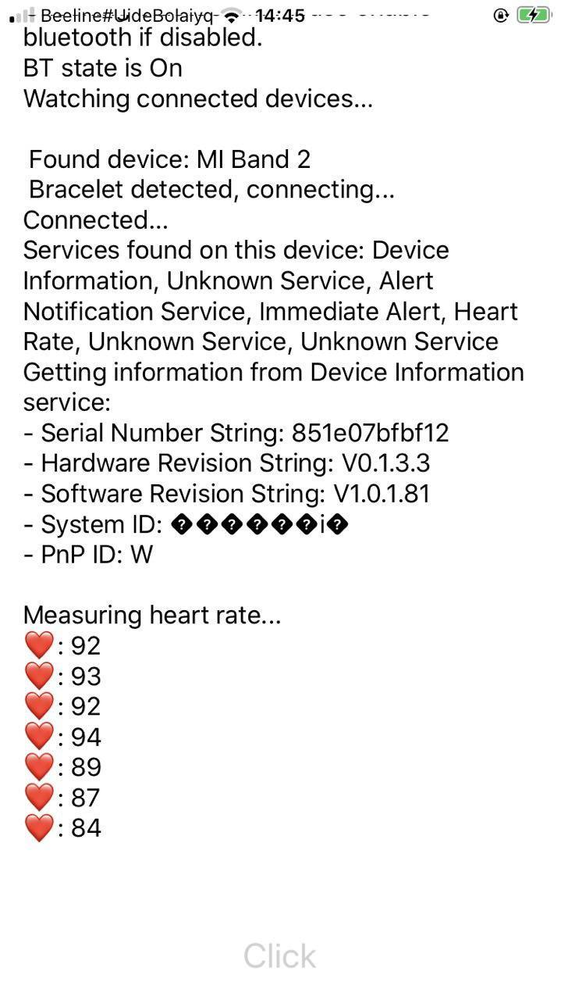

# Xamarin.Forms based application which reads Heart Rate information from Xiaomi MI Band 2

## General info
It should work on Android and iOS, but code not so clean. I created it as proof-of-concept of crossplatform app that interacts with fitness bracelet. 

## Dependencies
 - https://github.com/AL3X1/Mi-Band-2-SDK - was used as an example of interaction with MI Band 2.
- https://github.com/xabre/xamarin-bluetooth-le - used as main Bluetooth LE library it's installed by Nuget.
## How to run?
 1. Install MiFit application
 2. Pair your bracelet with MiFit app.
 3. Enable "Discovery" setting for bracelet (in MiFit app).
 4. Ensure that Blueetoth enabled and bracelet connected to phone.
 5. Build and run project for your platform (iOS, Android)  

## Technical Details
Mi Band 2 implements default heart rate service that described in Bluetooth GATT Specification, here: https://www.bluetooth.org/docman/handlers/downloaddoc.ashx?doc_id=239866, all services can be found here: https://www.bluetooth.com/specifications/gatt.
I've used xamarin-bluetooth-le library to interact with bracelet. 
Interaction steps:
   1. Resolving a device .
   2. Connecting to the device.
   3. Subsribing to heart rate update event.
   4. Starting heart rate measurement process.

## Useful links
 - https://github.com/inFullMobile/inFullBand - sample iOS App for interacting with MI Band 2
 - https://github.com/aashari/mi-band-2 - Android app to interact with Mi Band 2.
 - https://blog.infullmobile.com/introduction-to-bluetooth-le-on-ios-mi-band-2-case-study-343153921877 - interesting article about implementing iOS app and interact with Mi Band 2. 